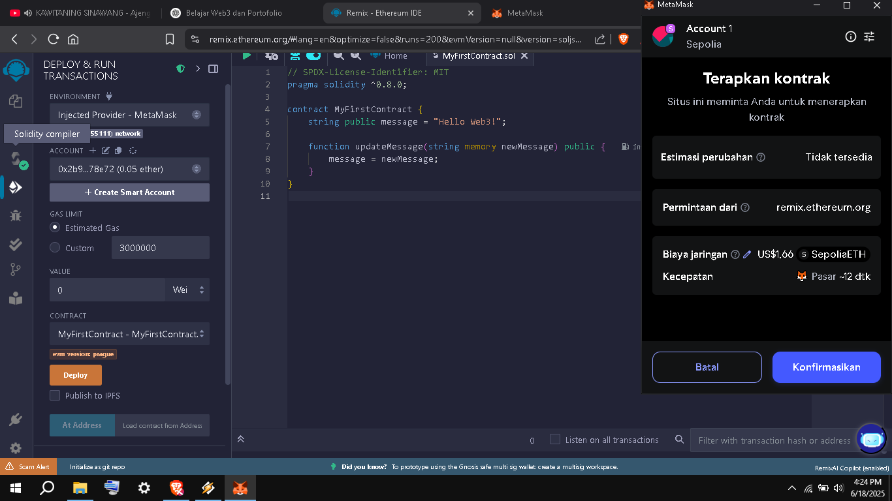
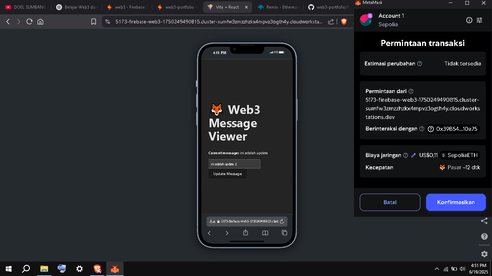

# 🚀 Web3 Portofolio – [Nama Kamu]

Halo! Ini adalah portofolio proyek Web3 saya. Semua dikerjakan menggunakan tools online (Remix, MetaMask, Firebase Studio) tanpa install apapun.

---

## 🔹 1. My First Smart Contract

📄 File: `MyFirstContract.sol`  
📍 Jaringan: Sepolia Testnet  
🔗 Alamat Kontrak: [0x39B54E194772BF4AF5ff7a973B6AbBDEf0610a75](https://sepolia.etherscan.io/address/0x39B54E194772BF4AF5ff7a973B6AbBDEf0610a75)  
🧪 Tools: Remix IDE + MetaMask

### Screenshot:

---

## 🔹 2. React Web3 dApp (Frontend)

🌐 Dibuat dengan: React JS + Ethers.js + Firebase Studio  
🎯 Fitur:
- Connect ke MetaMask
- Baca pesan dari blockchain
- Ubah pesan (dengan konfirmasi transaksi)

🔗 Live Preview

### Screenshot:

---

## ✅ Tools yang Digunakan

- MetaMask
- Remix IDE
- Sepolia Faucet
- Firebase Studio (StackBlitz)
- React JS
- Ethers.js

---

## 🚧 Rencana Next Project

- ✅ dApp dasar (done)
- ⏳ Token ERC-20 / NFT
- ⏳ Simpan data ke IPFS
- ⏳ Full-stack dApp

---

📬 Kontak: rominmuh230@gmail.com | GitHub: https://github.com/romiwebdev/web3-portfolio
