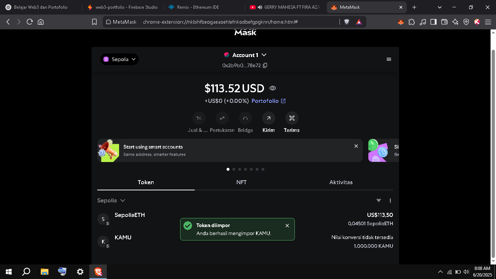

# 🚀 Web3 Portofolio – Muhromin
---

## 🔹 1. My First Smart Contract

📄 File: `MyFirstContract.sol`  
📍 Jaringan: Sepolia Testnet  
🔗 Alamat Kontrak: [0x39B54E194772BF4AF5ff7a973B6AbBDEf0610a75](https://sepolia.etherscan.io/address/0x39B54E194772BF4AF5ff7a973B6AbBDEf0610a75)  
🧪 Tools: Remix IDE + MetaMask

### Screenshot:

---

## 🔹 2. React Web3 dApp (Frontend)

🌐 Dibuat dengan: React JS + Ethers.js + Firebase Studio  
🎯 Fitur:
- Connect ke MetaMask
- Baca pesan dari blockchain
- Ubah pesan (dengan konfirmasi transaksi)

🔗 Live Preview
https://react-web3-dapp.vercel.app

### Screenshot:

---
## 🔹 3. ERC-20 Token - $KAMU

✅ Dibuat dengan Solidity + OpenZeppelin  
🧪 Jaringan: Sepolia  
💰 Jumlah Token: 1.000.000

### Fitur:
- Transfer token ke wallet lain
- Tersimpan di MetaMask
- Siap diintegrasi ke Web3 App

📄 Alamat Kontrak: 🔗 [Lihat di Etherscan](https://sepolia.etherscan.io/address/0xCA5950400E69694631a028cb4f3fF25a7Bf1C629)

### Screenshot:

---

📬 Kontak: rominmuh230@gmail.com | GitHub: https://github.com/romiwebdev/web3-portfolio
